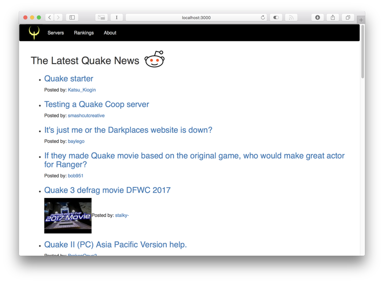
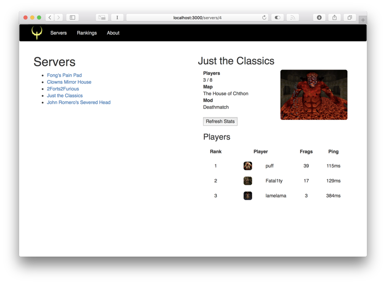

# Q-Live Demo
This project was my first attempt at writing a React application from scratch (as part of an interview). If you launch it, you'll see a homepage pulling headlines from the Quake Reddit and a few links to things like a mock server browser -- Quake 1 of course, the greatest FPS of all time!

 

Overall, it took about ~8 hours or so having never used React at all, aiming to simply play around the basics:
* React
* React router
* JSX
* Stateful & stateless components
* Basic application component layout

Not covered:
* Redux
* TypeScript

Don't mind the pretty rudimentary Bootstrap layout :) If anyone ever sees this, well hopefully it's a simple enough thing for you to learn from as well. This project was bootstrapped with [Create React App](https://github.com/facebookincubator/create-react-app).
